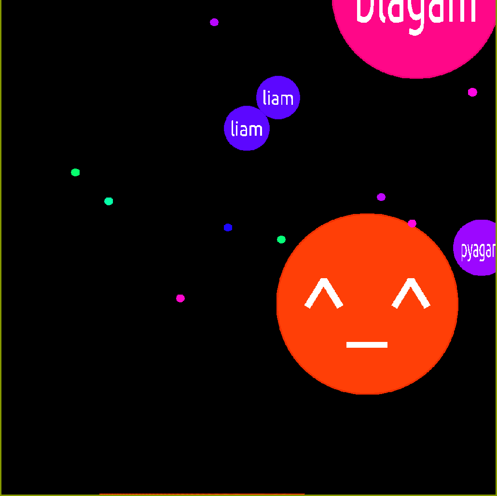

pyagar
======

``pyagar`` is a python client for the popular online game **agar.io**.

This package allows you to play the game, see the gameplay as an spectator
and also play automatically with the **auto** feature.

Dependencies
------------

In order to run this software you'll need:

- Python 3.4+
- SDL2 (you may found it in your distribution as libsdl2)
- sdl2_ttf https://www.libsdl.org/projects/SDL_ttf/
- sdl2_gfx http://cms.ferzkopp.net/index.php/software/13-sdl-gfx

Installation
------------

It is recomended to install this package into a virtualenv.

Stable version
~~~~~~~~~~~~~~

.. code-block:: bash

   $ pip install pyagar

Usage
-----

Command
~~~~~~~

This package creates the command ``pyagar``.

.. code-block:: bash

   $ pyagar --help
   usage: pyagar [-h] [--no-visualize] [-n NICK] [--auto] [--debug] [--spectate]

    optional arguments:
      -h, --help            show this help message and exit
      --no-visualize
      -n NICK, --nick NICK
      --auto
      --debug
      --spectate

Controls
~~~~~~~~

====== ============================================
Action Control
====== ============================================
Move   Mouse (Relative to the center of the window)
Start  Mouse (Left button)
Eject  ``W`` key
Split  ``Space`` key
====== ============================================

Play examples
-------------

Play setting a custom nick
~~~~~~~~~~~~~~~~~~~~~~~~~~

.. code-block:: bash

   $ pyagar -n doge

Just watch the game
~~~~~~~~~~~~~~~~~~~

.. code-block:: bash

   $ pyagar --spectate

Play automatically using the default bot
~~~~~~~~~~~~~~~~~~~~~~~~~~~~~~~~~~~~~~~~

.. code-block:: bash

   $ pyagar --auto

Other implementations
---------------------

- https://github.com/Gjum/pyAgar.io
- https://github.com/Raeon/pygar
